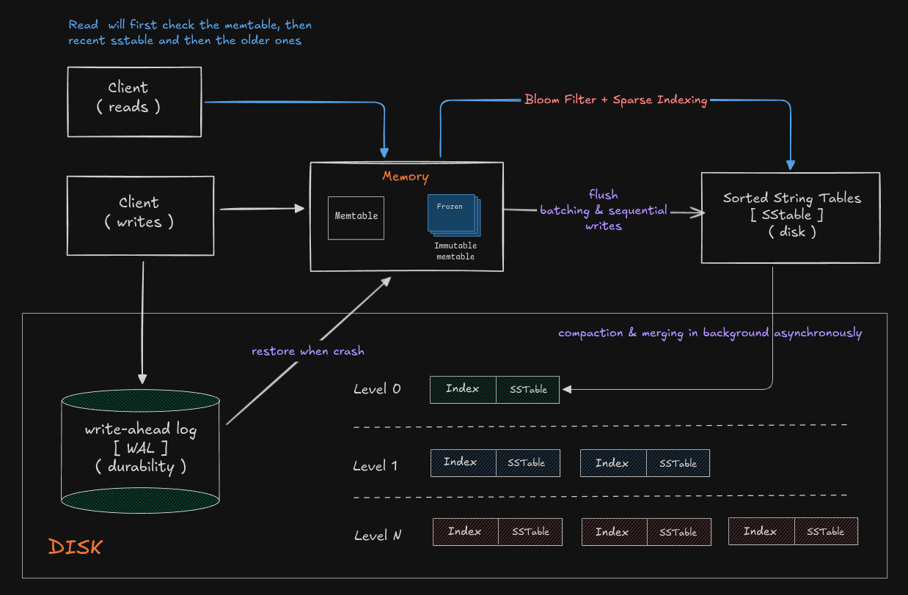

# py-lsm 🗄️

A Toy implementation of **LSM-tree** (Log-Structured Merge-Tree) - a high-performance key-value storage engine used in databases like LevelDB, RocksDB, and Apache Cassandra.

## Architecture



### Write Path
1. **WAL Write**: Key-value pair written to Write-Ahead Log (durability)
2. **MemTable Insert**: Data stored in in-memory sorted structure
3. **Auto Flush**: When MemTable reaches capacity, flush to SSTable
4. **SSTable Creation**: Immutable sorted files created on disk

### Read Path
1. **MemTable Check**: Search in-memory data first (fastest)
2. **SSTable Search**: If not found, search SSTables (newest to oldest)
3. **Bloom Filter**: Quick check if key might exist
4. **Sparse Index**: Find approximate location in file
5. **Sequential Scan**: Read from disk to find exact key in range provided by sparse index

## Usage

### Installation

```bash
# Clone the repository
git clone https://github.com/yourusername/py-lsm.git
cd py-lsm

# Install dependencies
pip install -r requirements.txt
```

### Interactive CLI

```bash
> python cli.py
```

```
╔═══════════════════════════════════════════╗
║     py-lsm: LSM-Tree Key-Value Store      ║
║        Type 'HELP' for commands           ║
╚═══════════════════════════════════════════╝

py-lsm> SET name yadnesh
OK
py-lsm> SET age 25
OK
py-lsm> GET name
yadnesh
py-lsm> KEYS
Keys in memtable (2):
  • age
  • name

py-lsm> STATS

[+] Database Statistics
───────────────────────────────────
  Memtable entries:  2
  SSTable files:     0
  Capacity:          100
  DB folder:         lsm_db

py-lsm> FLUSH
Memtable flushed to SSTable
py-lsm> EXIT
Goodbye!
```

### Programmatic Usage

```python
from lsm_engine import LSMEngine

# Create database instance
db = LSMEngine(db_folder="my_db", capacity=100)

# Write data
db.set("user:1", "alice")
db.set("user:2", "bob")
db.set("config:timeout", "30")

# Read data
value = db.get("user:1")  # Returns: "alice"

# Manual flush
db.flush()

# Close WAL
db.wal.close()
```

## CLI Commands

| Command | Description | Example |
|---------|-------------|---------|
| `SET <key> <value>` | Store a key-value pair | `SET name yadnesh` |
| `GET <key>` | Retrieve value by key | `GET name` |
| `FLUSH` | Force flush memtable to disk | `FLUSH` |
| `KEYS` | List all keys in memtable | `KEYS` |
| `STATS` | Show database statistics | `STATS` |
| `HELP` | Display help message | `HELP` |
| `CLEAR` | Clear the screen | `CLEAR` |
| `EXIT` / `QUIT` | Exit the CLI | `EXIT` |

### CLI Options

```bash
# Custom database folder
python cli.py --db my_database

# Custom memtable capacity
python cli.py --capacity 50

# Both options
python cli.py --db my_db --capacity 200
```

## File Structure

```
py-lsm/
├── cli.py                 # Interactive CLI interface
├── lsm_engine.py          # Main LSM-tree orchestrator
├── memtable.py            # In-memory sorted data structure
├── wal.py                 # Write-Ahead Log for durability
├── bloom_filter.py        # Probabilistic membership filter
├── sstable/
│   ├── __init__.py
│   ├── writer.py          # SSTable file writer
│   └── reader.py          # SSTable file reader
├── tests/
│   ├── test_quick.py      # Integration tests
│   └── test_sstable.py    # SSTable-specific tests
└── README.md
```

### Component Details

| File | Purpose | Key Features |
|------|---------|--------------|
| **`lsm_engine.py`** | Main orchestrator | Coordinates MemTable, WAL, and SSTables |
| **`memtable.py`** | In-memory storage | Dict-based O(1) writes, sorted on flush |
| **`wal.py`** | Durability log | Binary format with CRC32 checksums |
| **`sstable/writer.py`** | Disk writer | Creates sorted .sst files + sparse index |
| **`sstable/reader.py`** | Disk reader | Binary search with Bloom filter optimization |
| **`bloom_filter.py`** | Membership test | Configurable false-positive rate |
| **`cli.py`** | User interface | Redis-like interactive shell |

## How It Works

### MemTable
- **Data Structure**: Python dictionary for O(1) average-case writes
- **Capacity**: Configurable threshold (default: 100 entries)
- **Sorting**: Sorted during flush operation (O(n log n))

### Write-Ahead Log (WAL)
```
Record Format:
┌──────────────┬──────────────┬──────────────────┬──────┬───────┬──────────┐
│ key_len (4B) │ val_len (4B) │ checksum_len(4B) │ key  │ value │ checksum │
└──────────────┴──────────────┴──────────────────┴──────┴───────┴──────────┘
```
- **Durability**: `fsync()` after every write forces the data to be written to disk
- **Recovery**: Replay on startup to rebuild MemTable
- **Checksum**: CRC32 for corruption detection

### SSTable Files
```
data.sst (sorted key-value pairs):

apple    red fruit
banana   yellow fruit
cherry   small red fruit

index.sst (sparse index + bloom filter):

apple    0
date     59
grape    132
__BLOOM_START__
<serialized bloom filter bytes>
```

### Bloom Filter
- **Purpose**: Fast negative lookups (answers: if key is not in bloom filter, then it is not in SSTable) (avoid disk unnecessary disreads)
- **Error Rate**: 1% false positive rate
- **Size**: Calculated based on capacity `m = - (n * ln p) / (ln 2)^2` 
- **Hash Functions**: Multiple hash functions for accuracy `k = (m / n) * math.log(2)` 

## Testing

Run the test suite:

```bash
# Full integration test
python tests/test_quick.py

# SSTable-specific test
python tests/test_sstable.py
```

### Test Coverage
- WAL append and replay
- MemTable operations
- SSTable write and read
- LSM engine integration
- Crash recovery simulation
- Bloom filter functionality

## Performance Characteristics

| Operation | Time Complexity | Notes |
|-----------|----------------|-------|
| **Write** | O(1) avg | In-memory + WAL append |
| **Read (MemTable)** | O(1) avg | Dictionary lookup |
| **Read (SSTable)** | O(log n) | Binary search + sequential scan |
| **Flush** | O(n log n) | Sorting + disk write |
| **Recovery** | O(n) | WAL replay |

## Configuration

```python
LSMEngine(
    db_folder="lsm_db",      # Database directory
    capacity=100,            # MemTable size before flush
    sparsity_index=10        # Index every Nth key
)
```

### Tuning Parameters

- **`capacity`**: Higher = fewer flushes, more memory usage
- **`sparsity_index`**: Lower = faster reads, larger index files
- **Bloom filter error rate**: Lower = fewer false positives, larger filter

## Future Enhancements

- [ ] **Compaction**: Merge multiple SSTables to reduce file count
- [ ] **Tombstones**: Proper deletion support
- [ ] **Range Queries**: Scan operations for key ranges
- [ ] **Compression**: Reduce disk space usage
- [ ] **Multi-threading**: Concurrent reads
- [ ] **Leveled Compaction**: LevelDB-style tiered storage

## References

- [Bloom Filter](https://arpitbhayani.me/blogs/bloom-filters/) - Arpit Bhayani
- [Designing Data-Intensive Applications](https://www.oreilly.com/library/view/designing-data-intensive-applications/9781449373320/) - Martin Kleppmann
- [LSM-tree Paper](https://www.cs.umb.edu/~poneil/lsmtree.pdf) - Original 1996 paper
- [LevelDB](https://github.com/google/leveldb) - Google's LSM implementation
- [RocksDB](https://rocksdb.org/) - Facebook's fork of LevelDB


## License

MIT License - feel free to use this for learning and projects!

## Contributing

Contributions welcome! Feel free to:
- Report bugs
- Suggest features
- Submit pull requests

---

**Built with ❤️ for learning database internals**
